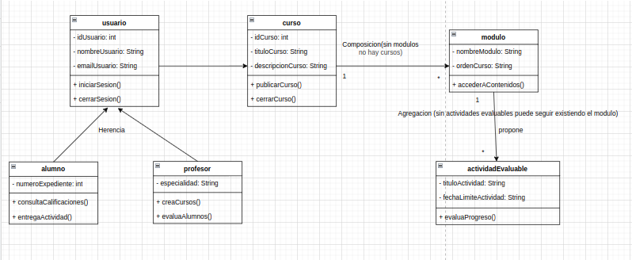

# UT4-A1 Digrama de clases para una plataforma de cursos online

***Nombre:***
***Curso:*** 

### ÍNDICE

+ [Enunciado](#id1)
+ [Objetivos](#id2)
+ [Tabla de clases, relaciones y cardinalidades](#id3)

#### ***Enunciado***. 

Una plataforma de formación online necesita un sistema que permita gestionar cursos, usuarios y el proceso de matriculación y evaluación. Realizar un diagrama de clases UML que permita modelar el sistema atendiendo a las siguientes premisas:

La plataforma gestiona usuarios registrados, de los cuales se almacenan un identificador, nombre y correo electrónico, y que pueden iniciar y cerrar sesión en el sistema. Existen dos tipos de usuarios: alumnos y profesores. Los alumnos, además de los datos comunes, disponen de un número de expediente y pueden matricularse en cursos ofrecidos por la plataforma, así como consultar las calificaciones obtenidas. Los profesores, identificados también como usuarios, cuentan con una especialidad y son los responsables de crear cursos y de evaluar a los alumnos en las distintas actividades.

Los cursos ofrecidos por la plataforma se identifican mediante un código, un título y una descripción, y pueden publicarse o cerrarse. Cada curso se estructura internamente en módulos formativos, que representan bloques temáticos ordenados dentro del curso. De cada módulo se almacena su nombre y el orden que ocupa dentro del curso, y permite acceder a los contenidos que lo forman. Un curso debe estar estructurado en módulos para poder impartirse.

Dentro de cada módulo se proponen actividades evaluables, de las que se registra un título y una fecha límite de entrega. Los alumnos pueden entregar una actividad dentro del plazo establecido. Las actividades son utilizadas para evaluar el progreso del alumnado, pero su definición no depende necesariamente de un único módulo concreto.

Como resultado de la evaluación de una actividad, se generan calificaciones, en las que se almacena la nota obtenida y un comentario asociado. Las calificaciones permiten determinar si una actividad ha sido superada o no. Un alumno puede obtener varias calificaciones a lo largo de su formación, y una misma actividad puede dar lugar a varias calificaciones correspondientes a distintos alumnos.

Un alumno puede estar matriculado simultáneamente en varios cursos y un mismo curso puede contar con varios alumnos matriculados. No es obligatorio que todos los alumnos estén matriculados en algún curso en un momento determinado, ni que un curso tenga alumnos mientras no esté publicado.

Los profesores utilizan las calificaciones exclusivamente en el momento de evaluar a los alumnos, sin que exista una relación permanente de almacenamiento entre profesores y calificaciones.

A partir de estas premisas, se deberá identificar correctamente las clases implicadas, sus atributos y métodos, así como deducir el tipo de relación existente entre ellas y las cardinalidades correspondientes, utilizando notación UML estándar.

#### ***Tabla de clases, relaciones y cardinalidades***. 

En la siguiente tabla debes especificar cada clase, la relación existente entre clases, justificación de la relación, cardinalidad y justificación de la cardinalidad

| Clase origen | Tipo de relación | Argumento del tipo de relación | Cardinalidad | Argumento de la cardinalidad |
|:------------:|:----------------:|:------------------------------:|:------------:|:----------------------------:|
|              |                  |                                |              |                              |
|              |                  |                                |              |                              |
|              |                  |                                |              |                              |
|              |                  |                                |              |                              |
|              |                  |                                |              |                              |
|              |                  |                                |              |                              |
|              |                  |                                |              |                              |

> ***PISTA IMPORTANTE:*** El número de filas de la tabla se corresponde exactamente con el número de relaciones entre las clases.

#### ***Diagrama de clases***. 

A continuación se muestra el diagrama de clases: 

> ***NOTA*** La imagen debe ser clara y estar correctamente insertada.
